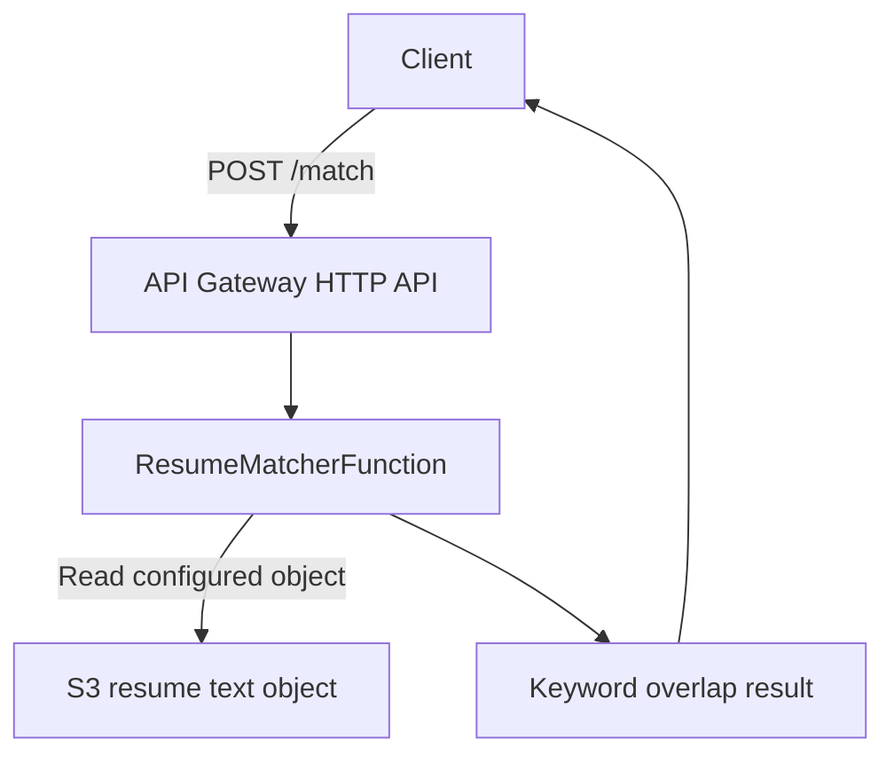

# Project Context

## Project Purpose

AWS Resume Matcher is a serverless portfolio project that scores how well a resume matches a job description. It demonstrates a practical AWS application lifecycle: a Python Lambda API, S3-backed data access, infrastructure as code with AWS SAM, and GitHub Actions CI/CD using OIDC authentication.

The codebase includes guarded semantic matching work toward v2.0.0. Semantic matching is guarded by `SEMANTIC_MATCHING_ENABLED=false` by default, so the deployed Lambda behavior remains keyword-based unless explicitly enabled with the required embedding provider configuration and AWS permissions.

## Business Problem Being Solved

Hiring teams and job seekers often need a quick way to compare a resume against a job description. This project provides a simple MVP that highlights overlapping and missing keywords so a reviewer can see whether the resume covers the language used in a target role.

This is not an applicant tracking system and does not make hiring decisions. It is a lightweight matching demonstration intended for technical evaluation and future extension.

## Current Architecture

The API accepts a JSON body with a `job_description` string. Lambda reads the configured resume object from S3, extracts normalized keywords from both texts, filters stop words, calculates a percentage score, and returns matching and missing keywords.

When semantic matching is explicitly enabled, the matcher can calculate semantic similarity through an embedding provider abstraction and return hybrid score details. The production-focused provider is Amazon Bedrock Titan Text Embeddings V2 with S3-cached resume embeddings. The local `sentence-transformers/all-MiniLM-L6-v2` provider remains available for validation. SAM now exposes semantic configuration and IAM, but semantic matching remains disabled by default.

## Key Files and Responsibilities

- `lambda/app.py`: Lambda handler, request parsing, S3 resume retrieval with ETag metadata, keyword extraction, embedding provider abstraction, Bedrock embedding provider, S3 resume embedding cache, guarded semantic scoring helpers, scoring, and JSON response creation.
- `tests/`: Pytest suite covering keyword extraction, comparison scoring, semantic scoring with mocked embeddings, Bedrock provider calls, S3 embedding cache behavior, request validation, error handling, and Lambda response structure with mocked AWS access.
- `requirements-dev.txt`: Local and CI development test dependencies.
- `template.yaml`: AWS SAM template for the HTTP API, Lambda function, Lambda environment variables, least-scoped S3 read policy, guarded Bedrock semantic configuration, embedding cache permissions, and stack outputs.
- `samconfig.toml`: Default SAM build and deploy settings for local CLI usage.
- `.github/workflows/ci.yml`: CI workflow for pull requests and pushes to `main`; validates and builds the SAM app and compiles Python sources.
- `.github/workflows/deploy.yml`: Deployment workflow for pushes to `main`; assumes an AWS role through GitHub OIDC and deploys the SAM stack.
- `frontend/index.html`: Placeholder frontend file; currently empty.
- `sample-data/`: Local-only sample data location ignored by Git.
- `.gitignore`: Excludes local AWS SAM artifacts, virtual environments, Python bytecode, environment files, and sample resume data.
- `README.md`: Public project overview and contributor-facing setup documentation.
- `CONTEXT.md`: Fast project orientation for contributors and AI coding assistants.

## Deployment Architecture

Deployments are handled by AWS SAM through GitHub Actions or local SAM CLI.

The SAM template manages:

- An API Gateway HTTP API named by CloudFormation logical ID `ResumeMatcherApi`.
- A Python 3.13 Lambda function named by CloudFormation logical ID `ResumeMatcherFunction`.
- Lambda environment variables populated from SAM parameters:
  - `ResumeBucket`
  - `ResumeKey`
- An inline IAM policy allowing `s3:GetObject` only for the configured resume object.
- Semantic environment variables defaulted with `SemanticMatchingEnabled` set to `false`.
- An inline IAM policy allowing `bedrock:InvokeModel` only for the configured embedding model.
- An inline IAM policy allowing S3 read/write access only under the configured embedding cache prefix.
- Outputs:
  - `ApiEndpoint`
  - `ResumeMatcherFunctionArn`

The resume S3 bucket and object are expected to exist outside this template. SAM grants read access to the configured object but does not create the bucket or upload the resume.

The embedding cache bucket is also expected to exist outside this template. If `EmbeddingCacheBucket` is blank, the function uses the resume bucket for cache objects under `EmbeddingCachePrefix`. A separate cache bucket is cleaner for lifecycle and access management, while reusing the resume bucket is simpler and cost-efficient for this portfolio app.

## Git Branching Strategy Used So Far

The repository has used short-lived feature branches merged into `main`. Observed remote feature branches include:

- `feature/aws-sam`
- `feature/github-actions-cicd`
- `feature/github-oidc-deploy`

The current `main` branch contains the completed SAM, CI, and deployment workflow phases. Tags currently present include `v1.0-serverless-api`, `v1.0.1`, and `v1.1.0`; the deploy workflow represents the v1.2.0 phase in the project history.

## CI/CD Workflow Explanation

### CI

`.github/workflows/ci.yml` runs on:

- Pull requests
- Pushes to `main`

It performs:

- Checkout
- Python 3.13 setup
- AWS SAM CLI setup
- Test dependency installation from `requirements-dev.txt`
- `python -m pytest`
- `sam validate --template-file template.yaml`
- `sam build --template-file template.yaml --cached --parallel`
- `python -m compileall lambda`

### Deployment

`.github/workflows/deploy.yml` runs only on pushes to `main`.

It performs:

- Checkout
- Python 3.13 setup
- AWS SAM CLI setup
- AWS credential configuration using `aws-actions/configure-aws-credentials`
- `sam validate --template-file template.yaml`
- `sam build --template-file template.yaml --cached --parallel`
- `sam deploy` with stack, region, resume bucket, and resume key values from repository variables

Required GitHub repository variables:

- `AWS_REGION`
- `AWS_DEPLOY_ROLE_ARN`
- `SAM_STACK_NAME`
- `RESUME_BUCKET`
- `RESUME_KEY`

Semantic parameters currently use SAM defaults and are not passed by the deployment workflow. To enable semantic matching from GitHub Actions later, add repository variables or workflow parameter overrides for the semantic parameters.

## AWS Resources Managed by SAM

Managed directly by `template.yaml`:

- API Gateway HTTP API
- Lambda function
- Lambda route integration for `POST /match`
- Lambda execution policy statement for S3 object reads
- CloudFormation outputs for API endpoint and Lambda ARN

Not managed by `template.yaml`:

- Resume S3 bucket
- Resume object upload
- Embedding cache bucket
- GitHub OIDC IAM identity provider
- GitHub deployment IAM role
- GitHub repository variables

## Important Design Decisions

- **Plain-text resume input**: Keeps the MVP small and avoids PDF/DOCX parsing complexity.
- **S3-backed resume storage**: Keeps personal resume content out of source control and allows the Lambda to read a configured object at runtime.
- **Keyword overlap scoring**: Provides deterministic, reviewable behavior without introducing ML dependencies.
- **Guarded semantic scoring**: Allows hybrid scoring without changing production Lambda packaging or CI/CD yet.
- **Bedrock production path**: Uses Amazon Titan Text Embeddings V2 through `bedrock-runtime` so standard SAM ZIP packaging can be preserved.
- **S3 resume embedding cache**: Avoids recomputing resume embeddings on every request by keying cached JSON embeddings on resume bucket, key, ETag, model ID, dimensions, normalization setting, and schema version.
- **Semantic disabled by default**: SAM carries the required configuration and IAM, but `SemanticMatchingEnabled` defaults to `false`.
- **AWS SAM over manual console setup**: Makes the deployable infrastructure explicit and repeatable.
- **HTTP API over REST API**: Keeps the API Gateway configuration lightweight for a single POST route.
- **OIDC over static AWS keys**: Avoids long-lived AWS credentials in GitHub and uses temporary role-based credentials for deployment.
- **Repository variables for deployment inputs**: Separates environment-specific values from workflow source.

## Known Limitations

- Production matching is keyword overlap by default; semantic matching is present only as an explicitly enabled guarded path.
- The repository has not yet validated Bedrock semantic matching in a deployed AWS environment.
- The deployment workflow does not yet pass semantic parameter overrides for enabling semantic matching.
- The API supports one configured resume object at a time.
- The project does not currently parse PDF, DOCX, or rich resume formats.
- `frontend/index.html` is empty, so there is no usable frontend yet.
- The SAM template does not create the resume S3 bucket or upload resume content.
- The API has no authentication, authorization, throttling policy, or custom domain configured in the template.
- Observability is minimal; there are no custom metrics, alarms, or tracing settings.

## Recommended Next Enhancements

- Add API-level integration tests using SAM local or a deployed test stack.
- Build a small frontend that posts job descriptions to the `/match` endpoint.
- Add resume upload or multi-resume support with explicit privacy controls.
- Add PDF and DOCX parsing.
- Validate Bedrock semantic matching in a deployed development environment.
- Add structured logging and CloudWatch alarms.
- Add a dev/prod environment strategy with separate stacks and repository variables.
- Add API authentication before public exposure.
- Document the AWS IAM trust policy needed for GitHub OIDC.

## Guidance for Future AI Assistants

- Read `README.md`, `CONTEXT.md`, `template.yaml`, `.github/workflows/*.yml`, and `lambda/app.py` before making changes.
- Keep documentation, application code, infrastructure code, workflows, and deployment configuration changes separated unless the user asks for a cross-cutting update.
- Do not commit resume data, secrets, `.env` files, `.aws-sam/`, or `sample-data/`.
- Do not invent features in documentation; verify the implementation first.
- Preserve the existing SAM logical IDs unless a migration plan is explicitly requested.
- Be careful with `samconfig.toml`; it contains environment-specific deployment defaults.
- If modifying deployment workflows, keep OIDC permissions scoped and avoid adding static AWS keys.
- If adding semantic tests, mock embedding vectors/models, Bedrock responses, and S3 cache interactions so CI does not download model weights or call AWS.
- If adding tests, prefer focused tests around parsing, keyword extraction, scoring, method validation, and S3 failure handling.
- Do not enable semantic matching in deployment workflows until Bedrock model access, cache bucket behavior, costs, and rollback behavior are validated in a development stack.
- If adding frontend behavior, note that `frontend/index.html` is currently empty and no frontend build toolchain exists.
