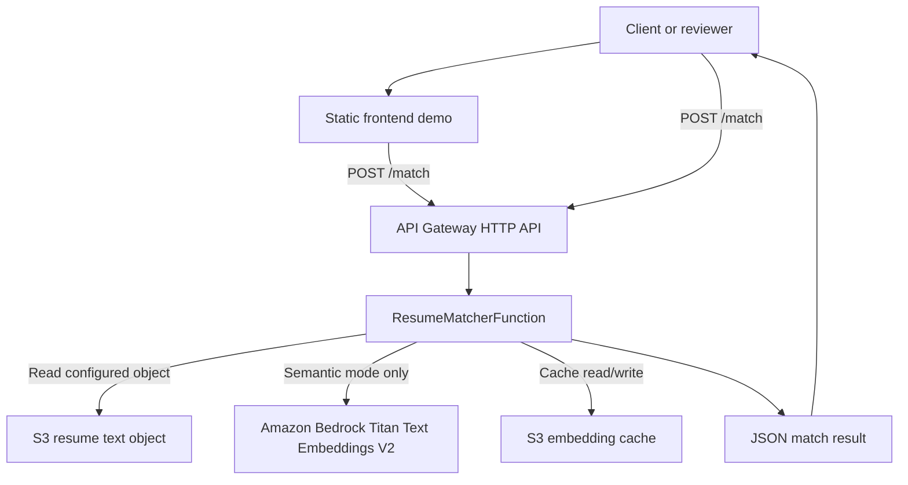

# Project Context

## Project Purpose

AWS Resume Matcher is a serverless AI portfolio project that scores how well a resume matches a job description. It demonstrates a practical AWS application lifecycle: a Python Lambda API, S3-backed data access, infrastructure as code with AWS SAM, GitHub Actions CI/CD using OIDC authentication, automated testing, and guarded semantic matching with Amazon Bedrock.

The codebase includes v2.6.0 evidence retrieval and chunk ranking improvements, v2.5.1 fit-analysis calibration on top of v2.5.0 explainable fit analysis, the v2.4.0 semantic chunking experiment, v2.3.0 keyword quality improvements, v2.2.0 frontend demo support, v2.1.0 resume and job-description intake expansion, and v2.0.0 guarded semantic matching. Semantic matching is guarded by `SEMANTIC_MATCHING_ENABLED=false` by default, so the deployed Lambda behavior remains keyword-based unless explicitly enabled with the required embedding provider configuration and AWS permissions.

The public repository presentation should position the project for recruiters, hiring managers, AWS reviewers, and technical audiences. The README should lead with what the app does, why it exists, current v2.6.0 status, architecture, key features, project evolution, frontend demo usage, demo request/response examples, and then setup/deployment details.

## Business Problem Being Solved

Hiring teams and job seekers often need a quick way to compare a resume against a job description. This project provides a matching API that highlights overlapping and missing keywords, and now includes a guarded semantic AI path that can capture meaning beyond exact keyword overlap and explain which job requirements have supporting resume evidence.

This is not an applicant tracking system and does not make hiring decisions. It is a lightweight matching demonstration intended for technical evaluation and future extension. The product direction after v2.4.0 is to evolve from a Resume Matcher toward an **Explainable Candidate Fit Analyzer**.

## Current Architecture



The API accepts an optional `resume_text` string for demo-oriented direct-text resume intake. If `resume_text` is omitted, Lambda reads the configured resume object from S3 and extracts text from `.txt`, `.pdf`, or `.docx` resume objects. The API accepts exactly one job-description input: a `job_description` string, a `job_description_file` object for inline `.txt`/`.md` content, or a `job_description_url`. It extracts normalized keywords from both texts, filters stop words and obvious token noise, calculates a percentage score, and returns matching and missing keywords.

When semantic matching is explicitly enabled, the matcher calculates semantic similarity through an embedding provider abstraction and returns hybrid score details. It also parses candidate job requirements, splits resume evidence chunks, scores requirement-to-evidence support with keyword overlap, semantic similarity, and requirement-scoped phrase aliases, and returns `matched_requirements` plus `gaps`. The production-focused provider is Amazon Bedrock Titan Text Embeddings V2 with S3-cached resume embeddings. End-to-end runtime validation has confirmed Bedrock invocation, semantic scoring, S3 cache creation, S3 cache reuse, IAM permissions, and the API Gateway to Lambda to Bedrock flow. The local `sentence-transformers/all-MiniLM-L6-v2` provider remains available for validation. SAM exposes semantic configuration and IAM, but semantic matching remains disabled by default.

v2.4.0 added an experimental `chunked_semantic_score` field in semantic mode for side-by-side comparison with the current whole-document `semantic_score`. This experiment did not redesign caching, final scoring, API requests, section parsing, or requirement extraction.

## Key Files and Responsibilities

- `lambda/app.py`: Lambda handler, request parsing, optional direct-text resume intake, S3 resume retrieval with ETag metadata, resume/job-description text extraction, keyword extraction, embedding provider abstraction, Bedrock embedding provider, S3 resume embedding cache, guarded semantic scoring helpers, requirement-to-evidence fit analysis, scoring, CORS-friendly headers, and JSON response creation.
- `lambda/requirements.txt`: Lambda package dependencies for lightweight PDF and DOCX text extraction.
- `tests/`: Pytest suite covering keyword extraction, comparison scoring, intake parsing, semantic scoring with mocked embeddings, Bedrock provider calls, S3 embedding cache behavior, request validation, error handling, and Lambda response structure with mocked AWS access.
- `requirements-dev.txt`: Local and CI development test dependencies.
- `template.yaml`: AWS SAM template for the HTTP API, CORS configuration, Lambda function, Lambda environment variables, least-scoped S3 read policy, guarded Bedrock semantic configuration, embedding cache permissions, and stack outputs.
- `samconfig.toml`: Default SAM build and deploy settings for local CLI usage.
- `.github/workflows/ci.yml`: CI workflow for pull requests and pushes to `main`; validates and builds the SAM app and compiles Python sources.
- `.github/workflows/deploy.yml`: Deployment workflow for pushes to `main`; assumes an AWS role through GitHub OIDC and deploys the SAM stack.
- `frontend/index.html`: Self-contained static frontend demo with embedded CSS and JavaScript.
- `sample-data/`: Local-only sample data location ignored by Git.
- `release_notes/`: Archived version-specific release notes such as `RELEASE_NOTES_v2.6.0.md`.
- `.gitignore`: Excludes local AWS SAM artifacts, virtual environments, Python bytecode, environment files, and sample resume data.
- `README.md`: Public project overview and contributor-facing setup documentation.
- `RELEASE_NOTES.md`: Latest-release summary and links to archived version-specific release notes.
- `CONTEXT.md`: Fast project orientation for contributors and AI coding assistants.

## Deployment Architecture

Deployments are handled by AWS SAM through GitHub Actions or local SAM CLI.

The SAM template manages:

- An API Gateway HTTP API named by CloudFormation logical ID `ResumeMatcherApi`.
- A Python 3.13 Lambda function named by CloudFormation logical ID `ResumeMatcherFunction`.
- Lambda environment variables populated from SAM parameters:
  - `ResumeBucket`
  - `ResumeKey`
- HTTP API CORS settings for browser-based demo calls.
- An inline IAM policy allowing `s3:GetObject` only for the configured resume object, which may be `.txt`, `.pdf`, or `.docx`.
- Semantic environment variables defaulted with `SemanticMatchingEnabled` set to `false`.
- An inline IAM policy allowing `bedrock:InvokeModel` only for the configured embedding model.
- An inline IAM policy allowing S3 list/read/write access only for the configured embedding cache prefix.
- Outputs:
  - `ApiEndpoint`
  - `ResumeMatcherFunctionArn`

The resume S3 bucket and object are expected to exist outside this template. SAM grants read access to the configured object but does not create the bucket or upload the resume.

The embedding cache bucket is also expected to exist outside this template. If `EmbeddingCacheBucket` is blank, the function uses the resume bucket for cache objects under `EmbeddingCachePrefix`. A separate cache bucket is cleaner for lifecycle and access management, while reusing the resume bucket is simpler and cost-efficient for this portfolio app.

## Git Branching Strategy Used So Far

The repository has used short-lived feature branches merged into `main`. Observed remote feature branches include:

- `feature/aws-sam`
- `feature/github-actions-cicd`
- `feature/github-oidc-deploy`

The current `main` branch contains the completed SAM, CI/CD, automated testing, v2.0.0 semantic matching, v2.1.0 intake expansion, v2.2.0 frontend demo, v2.3.0 keyword quality improvements, and v2.4.0 semantic experiment phases. The v2.4.0 work was developed on `feature/v2.4-semantic-experiment`, merged, deployed, tested, tagged, and released.

## Version History For Presentation

- **v1.0 Keyword Matching**: Serverless resume matching API with deterministic keyword overlap scoring.
- **v1.1 AWS SAM IaC**: Repeatable infrastructure definition for API Gateway, Lambda, IAM, and outputs.
- **v1.2 CI/CD**: GitHub Actions validation/build and OIDC-based AWS deployment.
- **v1.3 Automated Testing**: Pytest suite for request validation, scoring behavior, and Lambda responses.
- **v2.0 Semantic AI Matching**: Guarded Bedrock semantic matching, hybrid scoring, S3 embedding cache, SAM configuration, and scoped IAM.
- **v2.1 Intake Expansion**: Resume intake for `.txt`, `.pdf`, and `.docx`, plus job-description intake from direct text, inline `.txt`/`.md` content, and URL text extraction.
- **v2.2 Frontend Demo**: Framework-free static frontend and optional direct-text resume intake for reviewer-friendly demos.
- **v2.3 Keyword Quality Improvements**: Cleaner deterministic keyword extraction that filters numeric-list artifacts, contraction fragments, trailing punctuation, and selected low-value job-description filler while preserving technical terms such as AWS, S3, CI/CD, C++, and C#.
- **v2.4 Semantic Chunking Experiment**: Whole-document and simple paragraph/bullet chunked semantic score comparison, with real-world validation showing generic chunking did not materially improve scoring.
- **v2.5 Explainable Fit Analysis MVP**: Semantic-mode matched requirements, gaps, and supporting resume evidence produced by deterministic requirement parsing, resume evidence chunking, keyword overlap, and semantic similarity.
- **v2.5.1 Fit Analysis Calibration**: Real Bedrock/Titan score calibration that lowers the matched requirement threshold from `60` to `40` and logs privacy-safe score summaries for future tuning.
- **v2.6 Evidence Retrieval & Chunk Ranking**: Requirement-scoped phrase alias handling, alias-aware evidence ranking, and internal top-3 evidence diagnostics for better chunk selection while preserving the public response contract.

## v2.4.0 Semantic Experiment Findings

v2.4.0 tested the hypothesis that whole-document embeddings were hurting semantic scoring by diluting localized resume/job overlap.

The comparison was:

- Current whole-document semantic scoring: `semantic_score`
- Experimental simple chunked semantic scoring: `chunked_semantic_score`

Real-world test result:

```text
semantic_score         = 33
chunked_semantic_score = 30
```

The experiment showed no material improvement from generic paragraph/bullet chunked semantic matching. The conclusion is:

- Do not productionize generic chunked semantic matching as the next architecture change.
- Semantic similarity alone is not the product.
- Further quality improvements should focus on explainable candidate fit, requirement matching, and supporting evidence rather than broader document-similarity variants.

## Product and Architecture Direction

The chosen product direction is to evolve AWS Resume Matcher from a simple Resume Matcher toward an **Explainable Candidate Fit Analyzer**.

The architectural direction is:

- User-facing product: Candidate Fit Analyzer.
- Internal architecture: Requirement-to-Evidence Matching Engine.

This preserves the concrete resume/job-description use case while creating a more differentiated internal matching pattern that can compare job requirements against resume evidence.

## CI/CD Workflow Explanation

### CI

`.github/workflows/ci.yml` runs on:

- Pull requests
- Pushes to `main`

It performs:

- Checkout
- Python 3.13 setup
- AWS SAM CLI setup
- Test dependency installation from `requirements-dev.txt`
- `python -m pytest`
- `sam validate --template-file template.yaml`
- `sam build --template-file template.yaml --cached --parallel`
- `python -m compileall lambda`

### Deployment

`.github/workflows/deploy.yml` runs only on pushes to `main`.

It performs:

- Checkout
- Python 3.13 setup
- AWS SAM CLI setup
- AWS credential configuration using `aws-actions/configure-aws-credentials`
- `sam validate --template-file template.yaml`
- `sam build --template-file template.yaml --cached --parallel`
- `sam deploy` with stack, region, resume bucket, and resume key values from repository variables

Required GitHub repository variables:

- `AWS_REGION`
- `AWS_DEPLOY_ROLE_ARN`
- `SAM_STACK_NAME`
- `RESUME_BUCKET`
- `RESUME_KEY`

Semantic parameters currently use SAM defaults and are not passed by the deployment workflow. To enable semantic matching from GitHub Actions later, add repository variables or workflow parameter overrides for the semantic parameters.

## AWS Resources Managed by SAM

Managed directly by `template.yaml`:

- API Gateway HTTP API
- Lambda function
- Lambda route integration for `POST /match`
- Lambda execution policy statement for S3 object reads
- CloudFormation outputs for API endpoint and Lambda ARN

Not managed by `template.yaml`:

- Resume S3 bucket
- Resume object upload
- Embedding cache bucket
- GitHub OIDC IAM identity provider
- GitHub deployment IAM role
- GitHub repository variables

## Important Design Decisions

- **Extension-based resume intake**: Keeps one configured S3 resume object while allowing `.txt`, `.pdf`, and `.docx` through lightweight parsers.
- **Direct-text resume demo intake**: v2.2 adds optional `resume_text` so the static frontend can demonstrate arbitrary resume matching without introducing upload, session, or multi-resume infrastructure.
- **Additive job-description intake**: Preserves the existing `job_description` field and adds `job_description_file` plus `job_description_url` without changing response shape.
- **S3-backed resume storage**: Keeps personal resume content out of source control and allows the Lambda to read a configured object at runtime.
- **Keyword overlap scoring**: Provides deterministic, reviewable behavior without introducing ML dependencies.
- **Scoped keyword cleanup**: Keeps the keyword-only scoring architecture intact while removing obvious extraction noise. The cleanup intentionally avoids weighted scoring, phrase extraction, stemming, and lemmatization.
- **Guarded semantic scoring**: Allows hybrid scoring without changing production Lambda packaging or CI/CD yet.
- **Bedrock production path**: Uses Amazon Titan Text Embeddings V2 through `bedrock-runtime` so standard SAM ZIP packaging can be preserved.
- **URL intake guardrails**: URL job descriptions use standard-library HTTP fetching with a short timeout, a 1 MB response cap, and rejection of localhost, literal private IP addresses, non-HTTP schemes, and embedded credentials.
- **S3 resume embedding cache**: Avoids recomputing resume embeddings on every request by keying cached JSON embeddings on resume bucket, key, ETag, model ID, dimensions, normalization setting, and schema version.
- **Explainability as semantic-mode add-on**: v2.5.0 adds matched requirements and gaps only when semantic matching is enabled, preserving keyword-only response behavior and the existing top-level scoring model.
- **Fit-analysis threshold calibration**: v2.5.1 uses `MATCHED_REQUIREMENT_MIN_SCORE = 40` because real semantic-mode testing produced plausible requirement/evidence matches in the low-to-high 40s. The original `60` threshold was too strict for Titan embedding scores and classified strong TPM/AI evidence as gaps.
- **Privacy-safe fit-analysis diagnostics**: v2.5.1 logs score summary statistics and keeps selected evidence in internal debug structures without exposing extra scoring details in normal API responses.
- **Scoped evidence aliasing**: v2.6.0 applies phrase alias handling only inside requirement-to-evidence scoring. Global keyword extraction, top-level keyword score behavior, API request shape, and normal public response fields remain unchanged.
- **Top-k evidence diagnostics**: v2.6.0 retains the top three evidence chunks internally for tests and diagnostics while returning only one public evidence chunk per matched requirement.
- **v2.4 semantic experiment kept separate from production scoring**: `chunked_semantic_score` is returned for comparison in semantic mode, but the final `score` still uses the existing whole-document `semantic_score`.
- **Do not productionize generic chunked semantic matching**: Real-world v2.4.0 testing showed `semantic_score = 33` and `chunked_semantic_score = 30`, so generic chunking did not materially improve semantic relevance.
- **Explainability over document similarity**: Candidate fit should be measured through matched requirements, gaps, and supporting resume evidence rather than relying on semantic similarity alone.
- **Semantic disabled by default**: SAM carries the required configuration and IAM, but `SemanticMatchingEnabled` defaults to `false`.
- **AWS SAM over manual console setup**: Makes the deployable infrastructure explicit and repeatable.
- **HTTP API over REST API**: Keeps the API Gateway configuration lightweight for a single POST route.
- **Framework-free frontend**: Keeps v2.2 demo scope small with a single static HTML file and no frontend build pipeline.
- **OIDC over static AWS keys**: Avoids long-lived AWS credentials in GitHub and uses temporary role-based credentials for deployment.
- **Repository variables for deployment inputs**: Separates environment-specific values from workflow source.

## Known Limitations

- Production matching is keyword overlap by default; semantic matching is present only as an explicitly enabled guarded path.
- Requirement parsing is deterministic and intentionally lightweight; v2.6.0 does not classify requirements, infer importance, or use LLM extraction.
- Public fit-analysis output still returns a single best evidence chunk per matched requirement. Internal diagnostics retain the top three chunks, but normal API consumers do not receive expanded evidence-ranking metadata.
- v2.4.0 generic chunked semantic scoring is experimental only and should not be treated as the future production semantic design.
- The deployment workflow does not yet pass semantic parameter overrides for enabling semantic matching.
- The API supports one configured resume object at a time when using S3-backed intake.
- Direct-text `resume_text` intake is intended for demos and does not provide persistent resume management.
- URL job-description intake depends on the remote page being reachable from Lambda and having extractable text.
- The SAM template does not create the resume S3 bucket or upload resume content.
- The API has no authentication, authorization, throttling policy, or custom domain configured in the template.
- Observability is minimal; there are no custom metrics, alarms, or tracing settings.

## Recommended Next Enhancements

v2.5.0 established the first Explainable Fit Analysis MVP with `matched_requirements`, `gaps`, and supporting resume evidence in semantic mode. v2.5.1 calibrated the initial match threshold, and v2.6.0 improved requirement-to-evidence retrieval for high-signal phrase variants. Future quality work should expand evidence-ranking calibration from more real Bedrock/Titan examples before adding requirement classification, requirement weighting, confidence models, or richer generated explanations.

Additional future enhancements:

- Expand evidence retrieval calibration and phrase alias coverage after more real semantic-mode testing.
- Add API-level integration tests using SAM local or a deployed test stack.
- Add resume upload or multi-resume support with explicit privacy controls. This may replace or augment the v2.2 direct-text resume demo path.
- Add requirement classification, importance weighting, confidence models, and richer explanations after evidence retrieval quality improves.
- Add structured logging and CloudWatch alarms.
- Add a dev/prod environment strategy with separate stacks and repository variables.
- Add API authentication before public exposure.
- Document the AWS IAM trust policy needed for GitHub OIDC.

## Open-Source Ecosystem Findings

Research into open-source resume matching and ATS-style fit-analysis tools found that resume scoring, keyword matching, missing-keyword analysis, and broad semantic similarity are commodity features. Many GitHub projects and libraries already provide resume/JD comparison, ATS-style scores, embedding-based similarity, or LLM-assisted resume feedback.

What appears more differentiated is requirement-to-evidence matching:

- Extract or approximate job requirements.
- Match each requirement to supporting resume evidence.
- Return clear matched requirements and gaps.
- Preserve explainability and deterministic scoring where possible.

This supports the v2.5.0 direction: build an Explainable Candidate Fit Analyzer on top of an internal Requirement-to-Evidence Matching Engine rather than investing further in generic document-similarity variants.

## GitHub Presentation Recommendations

- **About text**: Serverless AWS resume matcher with Lambda, API Gateway, S3, SAM, GitHub Actions OIDC, and guarded Bedrock semantic AI scoring.
- **Website URL**: Use the GitHub repository URL until a safe public demo or GitHub Pages frontend exists. Do not expose a live unauthenticated API endpoint as the website URL.
- **Topics**: `aws`, `aws-lambda`, `api-gateway`, `amazon-s3`, `amazon-bedrock`, `serverless`, `aws-sam`, `github-actions`, `oidc`, `python`, `pytest`, `semantic-search`, `embeddings`, `portfolio-project`, `resume-matcher`.

## Guidance for Future AI Assistants

- Read `README.md`, `CONTEXT.md`, `template.yaml`, `.github/workflows/*.yml`, and `lambda/app.py` before making changes.
- Keep documentation, application code, infrastructure code, workflows, and deployment configuration changes separated unless the user asks for a cross-cutting update.
- Keep the repo root focused on high-level project files. Put version-specific release notes in `release_notes/` and keep only the latest-release summary in root `RELEASE_NOTES.md`.
- Do not commit resume data, secrets, `.env` files, `.aws-sam/`, or `sample-data/`.
- Do not invent features in documentation; verify the implementation first.
- Preserve the existing SAM logical IDs unless a migration plan is explicitly requested.
- Be careful with `samconfig.toml`; it contains environment-specific deployment defaults.
- If modifying deployment workflows, keep OIDC permissions scoped and avoid adding static AWS keys.
- If adding semantic tests, mock embedding vectors/models, Bedrock responses, and S3 cache interactions so CI does not download model weights or call AWS.
- If adding tests, prefer focused tests around parsing, keyword extraction, scoring, method validation, and S3 failure handling.
- Do not enable semantic matching in deployment workflows without explicit parameter overrides and a rollback plan.
- If adding frontend behavior, preserve the framework-free static demo unless a future milestone explicitly introduces a frontend build toolchain.
