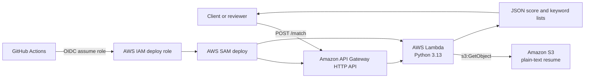

# AWS Resume Matcher

AWS Resume Matcher is a small serverless API that compares a job description against a plain-text resume stored in Amazon S3. It returns a keyword-overlap score, the matching keywords, and the missing keywords.

The project also includes guarded semantic matching work toward v2.0.0. Semantic matching is disabled by default with `SEMANTIC_MATCHING_ENABLED=false`; the deployed API remains keyword-based unless semantic mode is explicitly enabled and the required Bedrock/S3 permissions are configured.

The project is designed as a practical AWS portfolio application: simple enough to review quickly, but complete enough to demonstrate Lambda, API Gateway, S3 access, AWS SAM infrastructure as code, GitHub Actions CI, and GitHub OIDC-based deployment.

## Architecture



## Technology Stack

- Python 3.13
- AWS Lambda
- Amazon API Gateway HTTP API
- Amazon S3
- AWS SAM
- GitHub Actions
- GitHub OIDC for AWS authentication
- Guarded semantic matching with Amazon Bedrock Titan Text Embeddings V2
- Optional local semantic validation with `sentence-transformers/all-MiniLM-L6-v2`

## AWS Services Used

- **AWS Lambda** runs the resume matching handler in `lambda/app.py`.
- **Amazon API Gateway HTTP API** exposes `POST /match`.
- **Amazon S3** stores the configured plain-text resume object.
- **Amazon Bedrock** is the production-focused embedding provider for guarded semantic matching.
- **AWS IAM** grants the Lambda function read access to the configured resume object, scoped Bedrock model invocation for guarded semantic matching, scoped S3 embedding-cache list/read/write access, and allows GitHub Actions to assume a deployment role.
- **AWS CloudFormation** is used through AWS SAM to provision and update the stack.

## Current Features

- Accepts a JSON request containing `job_description`.
- Reads a configured plain-text resume from S3.
- Extracts normalized keywords from the resume and job description.
- Filters common stop words.
- Returns:
  - `score`
  - `matching_keywords`
  - `missing_keywords`
- Rejects non-POST methods.
- Validates empty or malformed request bodies.
- Includes a pytest suite for keyword extraction, comparison scoring, request validation, error handling, and Lambda response structure.
- Defines infrastructure with AWS SAM.
- Runs automated tests, CI validation, and SAM build in GitHub Actions.
- Deploys from GitHub Actions to AWS using OIDC and repository variables.
- Includes guarded hybrid keyword + semantic scoring helpers using an embedding provider abstraction.
- Includes an Amazon Bedrock embedding provider and S3-backed resume embedding cache. This path is configured in SAM but not enabled by default.

## Local Development Setup

Install:

- Python 3.13
- AWS CLI
- AWS SAM CLI
- Git

Clone the repository and confirm the SAM template is valid:

```bash
git clone <repository-url>
cd aws-resume-matcher
python -m venv .venv
source .venv/bin/activate
python -m pip install -r requirements-dev.txt
python -m pytest
sam validate --template-file template.yaml
sam build --template-file template.yaml --cached --parallel
```

On Windows PowerShell, activate the virtual environment with:

```powershell
.\.venv\Scripts\Activate.ps1
```

This repository intentionally excludes resume files. For local experiments, create a private plain-text resume file outside version control, for example:

```text
sample-data/resume.txt
```

The `sample-data/` directory is ignored by Git to reduce the risk of publishing personal information.

### Guarded Semantic Matching

Semantic matching is implemented behind `SEMANTIC_MATCHING_ENABLED`, which defaults to `false`. When the flag is disabled, the API keeps the original keyword-only production response shape.

The production-focused semantic provider is Amazon Bedrock Titan Text Embeddings V2:

```text
SEMANTIC_MATCHING_ENABLED=true
SEMANTIC_EMBEDDING_PROVIDER=bedrock
BEDROCK_EMBEDDING_MODEL_ID=amazon.titan-embed-text-v2:0
BEDROCK_EMBEDDING_DIMENSIONS=512
EMBEDDING_CACHE_BUCKET=<bucket for cached resume embeddings>
EMBEDDING_CACHE_PREFIX=embeddings/resume
```

`SEMANTIC_EMBEDDING_PROVIDER` defaults to `bedrock` when semantic matching is enabled. `BEDROCK_EMBEDDING_MODEL_ID`, `BEDROCK_EMBEDDING_DIMENSIONS`, and `EMBEDDING_CACHE_PREFIX` also have code defaults. `EMBEDDING_CACHE_BUCKET` falls back to `RESUME_BUCKET` if it is not set.

Resume embeddings are cached in S3 as JSON. The cache key accounts for the resume bucket, resume key, resume S3 ETag, embedding model ID, embedding dimensions, normalization setting, and cache schema version. This allows a changed resume or changed embedding configuration to produce a new cache object automatically.

For production, a separate embedding cache bucket is recommended when you want clearer lifecycle, access, and cleanup boundaries. For this portfolio app, using the existing resume bucket with the default `embeddings/resume` prefix is acceptable and cost-efficient because it avoids another bucket and keeps the IAM scope prefix-limited.

The local validation provider remains available for experiments:

```text
SEMANTIC_MATCHING_ENABLED=true
SEMANTIC_EMBEDDING_PROVIDER=local
SEMANTIC_MODEL_NAME=sentence-transformers/all-MiniLM-L6-v2
```

This repository does not add `sentence-transformers` to the default CI dependency set, does not download model weights in CI, does not change SAM packaging, and does not use Lambda container images. To experiment locally with the local provider, install the optional dependency in your local environment:

```bash
python -m pip install sentence-transformers
```

When semantic mode is disabled, responses keep the original production shape:

```json
{
  "score": 75,
  "matching_keywords": ["aws", "python", "s3"],
  "missing_keywords": ["docker"]
}
```

When semantic mode is enabled in an environment with the required provider configuration and permissions, responses include hybrid scoring details:

```json
{
  "score": 89,
  "keyword_score": 75,
  "semantic_score": 100,
  "matching_keywords": ["lambda", "python", "s3"],
  "missing_keywords": ["terraform"],
  "semantic_model": "amazon.titan-embed-text-v2:0",
  "semantic_provider": "bedrock",
  "weights": {
    "keyword": 0.45,
    "semantic": 0.55
  }
}
```

## Running Locally

The Lambda function expects two environment variables:

```text
RESUME_BUCKET=<bucket containing the resume text file>
RESUME_KEY=<path/to/resume.txt>
```

For a local API run with SAM, use the template parameters that populate those variables:

```bash
sam build --template-file template.yaml --cached --parallel
sam local start-api \
  --parameter-overrides \
    ResumeBucket=<your-bucket> \
    ResumeKey=<your-resume-key>
```

Then call the local endpoint:

```bash
curl -X POST http://127.0.0.1:3000/match \
  -H "Content-Type: application/json" \
  -d "{\"job_description\":\"Python AWS Lambda S3 API Gateway\"}"
```

Expected response shape:

```json
{
  "score": 0,
  "matching_keywords": [],
  "missing_keywords": []
}
```

The exact values depend on the resume object and job description.

## AWS SAM Deployment Process

Infrastructure is defined in `template.yaml`. The SAM stack provisions:

- `ResumeMatcherApi`
- `ResumeMatcherFunction`
- Lambda environment variables for `RESUME_BUCKET` and `RESUME_KEY`
- An IAM policy allowing the function to read only the configured S3 object
- Lambda environment variables for guarded Bedrock semantic matching, defaulted off
- An IAM policy allowing scoped `bedrock:InvokeModel` access to the configured embedding model
- An IAM policy allowing S3 list/read/write access to the configured embedding cache prefix
- Stack outputs for the API endpoint and Lambda function ARN

Manual deployment can be performed with SAM:

```bash
sam validate --template-file template.yaml
sam build --template-file template.yaml --cached --parallel
sam deploy
```

The repository includes `samconfig.toml` with default build and deploy settings. The deploy parameter values should be reviewed before using them in another AWS account. Semantic matching remains disabled by default in `samconfig.toml`.

The SAM template exposes these semantic parameters:

- `SemanticMatchingEnabled`
- `SemanticEmbeddingProvider`
- `BedrockEmbeddingModelId`
- `BedrockEmbeddingDimensions`
- `EmbeddingCacheBucket`
- `EmbeddingCachePrefix`

The deployment workflow still uses the existing required repository variables. To enable semantic matching through GitHub Actions later, add repository variables or workflow parameter overrides for the semantic parameters and validate Bedrock model access in the target account and region.

## GitHub Actions CI/CD Overview

The repository has two workflows:

- `.github/workflows/ci.yml`
  - Runs on pull requests and pushes to `main`.
  - Installs Python 3.13 and AWS SAM CLI.
  - Installs pytest test dependencies.
  - Runs `python -m pytest`.
  - Runs `sam validate`.
  - Runs `sam build --cached --parallel`.
  - Compiles Python sources under `lambda/`.
- `.github/workflows/deploy.yml`
  - Runs only on pushes to `main`.
  - Uses GitHub OIDC to assume an AWS deployment role.
  - Installs Python 3.13 and AWS SAM CLI.
  - Runs SAM validation, build, and deployment.

The deployment workflow uses these GitHub repository variables:

- `AWS_REGION`
- `AWS_DEPLOY_ROLE_ARN`
- `SAM_STACK_NAME`
- `RESUME_BUCKET`
- `RESUME_KEY`

Semantic parameters have defaults in `template.yaml` and `samconfig.toml`; no additional repository variables are required while semantic matching remains disabled.

## GitHub OIDC Authentication Overview

The deploy workflow uses `aws-actions/configure-aws-credentials` with GitHub OIDC. Instead of storing long-lived AWS access keys in GitHub, GitHub requests a short-lived OIDC token during the workflow run. AWS IAM validates that token against the trust policy on the configured deployment role, then issues temporary credentials for the job.

At a high level, the AWS deployment role should:

- Trust GitHub's OIDC identity provider.
- Restrict assumptions to the intended repository, branch, and workflow context.
- Grant only the permissions required for SAM and CloudFormation deployment.

No AWS secrets are stored in the repository.

## Repository Structure

```text
.
|-- .github/
|   `-- workflows/
|       |-- ci.yml
|       `-- deploy.yml
|-- frontend/
|   `-- index.html
|-- lambda/
|   `-- app.py
|-- tests/
|   |-- conftest.py
|   `-- test_app.py
|-- sample-data/
|   `-- resume.txt
|-- .gitignore
|-- CONTEXT.md
|-- README.md
|-- requirements-dev.txt
|-- samconfig.toml
`-- template.yaml
```

Notes:

- `frontend/index.html` is currently present but empty.
- `sample-data/` is ignored by Git and should not be used for public resume data.
- `.aws-sam/`, caches, virtual environments, and Python bytecode are ignored.

## Future Roadmap

- Add a small frontend for reviewer-friendly API interaction.
- Support PDF or DOCX resume ingestion.
- Validate guarded Bedrock semantic matching in a deployed development environment.
- Add weighted scoring for skills, certifications, seniority, and domain experience.
- Support multiple resumes and candidate ranking.
- Add authentication or rate limiting before any public deployment.
- Add structured logging, tracing, and operational metrics.
- Add a separate deployment environment strategy, such as dev and prod stacks.

## Version History Summary

- **v1.0.0 / `v1.0-serverless-api`**: Introduced the serverless resume matching API and removed local resume data from tracked files.
- **v1.0.1**: Improved deployment documentation for the initial Lambda-based MVP.
- **v1.1.0**: Migrated infrastructure into AWS SAM with an HTTP API, Lambda function, IAM policy, and stack outputs.
- **v1.2.0**: Added GitHub Actions CI/CD support, including SAM validation/build in CI and OIDC-based deployment from pushes to `main`.
- **v1.3.0**: Added pytest-based automated testing and updated CI to run tests before SAM validation and build.
- **v2.0.0**: In progress. Adds guarded semantic matching with Amazon Bedrock embeddings and S3 resume embedding caching while preserving keyword-only behavior by default.
