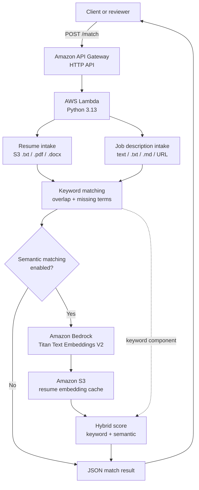
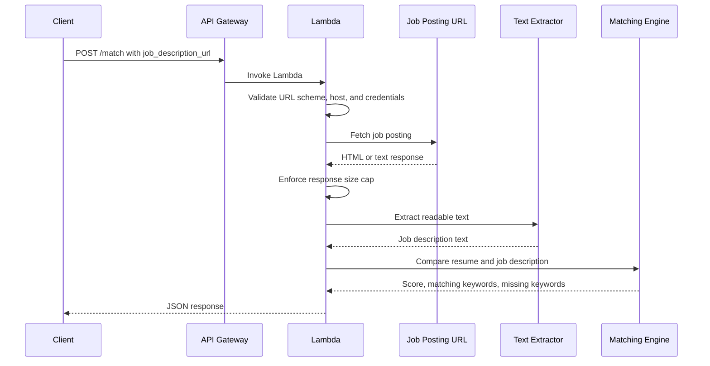

# AWS Resume Matcher

[](https://github.com/jon-innnput/aws-resume-matcher/actions/workflows/ci.yml)
[](https://github.com/jon-innnput/aws-resume-matcher/actions/workflows/deploy.yml)


AWS Resume Matcher is a serverless AI portfolio project that scores how well a resume matches a job description. It supports `.txt`, `.pdf`, and `.docx` resumes from Amazon S3; direct text, `.txt`, Markdown, and URL-based job descriptions; deterministic keyword scoring; and optional hybrid semantic matching powered by Amazon Bedrock Titan Text Embeddings V2.

The project exists to demonstrate a practical AWS application lifecycle: serverless API design, S3-backed data access, infrastructure as code, CI/CD, least-privilege AWS permissions, automated tests, and an incremental path from deterministic keyword matching to guarded semantic AI matching.

**Current status:** v2.1.0 is complete and validated. Keyword matching remains the default production behavior. Semantic matching is implemented behind `SEMANTIC_MATCHING_ENABLED=false` and can be enabled after Bedrock access and embedding-cache permissions are configured in the target AWS account.

## At A Glance

| Area | Capability |
| --- | --- |
| Resume intake | `.txt`, `.pdf`, and `.docx` resumes from a private S3 object |
| Job description intake | Direct text, inline `.txt`, inline Markdown, or HTTP/HTTPS URL |
| Matching | Deterministic keyword overlap with optional hybrid semantic scoring |
| AI provider | Amazon Bedrock Titan Text Embeddings V2 |
| Architecture | API Gateway, Lambda, S3, Bedrock, and SAM |
| Delivery | GitHub Actions CI/CD with OIDC-based AWS deployment |
| Testing | pytest, SAM validation, SAM build, and Python compilation |

## What This Demonstrates

- Serverless API design with Amazon API Gateway and AWS Lambda.
- Private S3-backed document intake without committing resume data to source control.
- Lightweight `.txt`, `.pdf`, and `.docx` resume extraction in Python.
- Multiple job-description intake paths, including URL and Markdown/TXT payloads.
- Deterministic keyword scoring with an optional Bedrock semantic layer.
- S3 embedding-cache design for avoiding repeated resume embedding work.
- Least-privilege IAM and repeatable infrastructure through AWS SAM.
- CI/CD with GitHub Actions, OIDC role assumption, and automated pytest coverage.

## Architecture



## Supported Inputs

| Input | Supported formats | Source |
| --- | --- | --- |
| Resume | `.txt`, `.pdf`, `.docx` | Configured private S3 object through `RESUME_BUCKET` and `RESUME_KEY` |
| Job description | Direct text | `job_description` JSON field |
| Job description | `.txt`, `.md` | Inline `job_description_file` JSON object |
| Job description | URL | `job_description_url` HTTP/HTTPS job posting |

The API accepts exactly one job-description input per request. Resume files remain private S3 objects and are not stored in the repository.

### URL Ingestion Flow



## Key Capabilities

- Serverless `POST /match` API backed by API Gateway and AWS Lambda.
- Resume loaded from a configured private S3 object instead of source control, with `.txt`, `.pdf`, and `.docx` intake support.
- Job description intake through direct JSON text, inline `.txt` or `.md` file content, or an HTTP/HTTPS URL.
- Deterministic keyword extraction, stop-word filtering, overlap scoring, matching keywords, and missing keywords.
- Guarded hybrid keyword + semantic scoring using Amazon Bedrock Titan Text Embeddings V2.
- S3 embedding cache keyed by resume bucket, resume key, S3 ETag, embedding model, dimensions, normalization setting, and cache schema version.
- AWS SAM infrastructure as code for API Gateway, Lambda, environment variables, IAM policies, and stack outputs.
- GitHub Actions CI for tests, SAM validation, SAM build, and Python compilation.
- GitHub Actions deployment through OIDC-based AWS role assumption, with no long-lived AWS keys in the repository.
- Pytest coverage for keyword scoring, request validation, semantic helpers, Bedrock provider behavior, S3 cache behavior, and SAM semantic configuration.
- Semantic matching disabled by default to preserve the original keyword-only response shape unless intentionally enabled.
- Lightweight document parsing with `pypdf` and `python-docx`; URL intake uses Python standard-library networking and HTML text extraction.

## Technology Stack

- Python 3.13
- AWS Lambda
- Amazon API Gateway HTTP API
- Amazon S3
- Amazon Bedrock Titan Text Embeddings V2
- AWS SAM / AWS CloudFormation
- AWS IAM
- GitHub Actions
- GitHub OIDC
- Pytest
- Optional local semantic validation with `sentence-transformers/all-MiniLM-L6-v2`

## Example Requests And Responses

### Direct Text Job Description

```bash
curl -X POST https://<api-id>.execute-api.<region>.amazonaws.com/match \
  -H "Content-Type: application/json" \
  -d '{"job_description":"Python developer with AWS Lambda, S3, API Gateway, CI/CD, and semantic search experience."}'
```

### Inline File Job Description

```bash
curl -X POST https://<api-id>.execute-api.<region>.amazonaws.com/match \
  -H "Content-Type: application/json" \
  -d '{"job_description_file":{"filename":"job.md","content":"# Role\nPython developer with AWS Lambda and S3 experience."}}'
```

### URL Job Description

```bash
curl -X POST https://<api-id>.execute-api.<region>.amazonaws.com/match \
  -H "Content-Type: application/json" \
  -d '{"job_description_url":"https://example.com/jobs/serverless-python-developer"}'
```

### Keyword-Only Response

```json
{
  "score": 75,
  "matching_keywords": ["api", "aws", "gateway", "lambda", "python", "s3"],
  "missing_keywords": ["semantic"]
}
```

### Semantic-Mode Response

```json
{
  "score": 89,
  "keyword_score": 75,
  "semantic_score": 100,
  "matching_keywords": ["api", "aws", "gateway", "lambda", "python", "s3"],
  "missing_keywords": ["terraform"],
  "semantic_model": "amazon.titan-embed-text-v2:0",
  "semantic_provider": "bedrock",
  "weights": {
    "keyword": 0.45,
    "semantic": 0.55
  }
}
```

### Score Fields

- `score`: The final match score returned to the client. In keyword-only mode, this is the keyword score. In semantic mode, this is the weighted hybrid score.
- `keyword_score`: The percentage of extracted job-description keywords found in the resume. Present when semantic mode is enabled.
- `semantic_score`: The embedding-similarity score between the resume and job description. Present when semantic mode is enabled.

Exact scores depend on the configured resume object and the submitted job description.

## Project Evolution

- **v1.0 Keyword Matching**: Introduced the serverless resume matching MVP with deterministic keyword overlap scoring.
- **v1.1 AWS SAM IaC**: Migrated infrastructure into AWS SAM for repeatable API Gateway, Lambda, IAM, and output provisioning.
- **v1.2 CI/CD**: Added GitHub Actions validation, SAM build checks, and OIDC-based deployment from `main`.
- **v1.3 Automated Testing**: Added pytest coverage for matching behavior, request handling, and Lambda responses.
- **v2.0 Semantic AI Matching**: Added guarded Amazon Bedrock semantic matching, hybrid scoring, S3 embedding caching, SAM configuration, and least-privilege IAM while keeping keyword-only mode as the default.
- **v2.1 Intake Expansion**: Added resume intake for `.txt`, `.pdf`, and `.docx`, plus job-description intake from direct text, inline `.txt`/`.md` content, and URL text extraction.

## Local Development

Install:

- Python 3.13
- AWS CLI
- AWS SAM CLI
- Git

Clone the repository and validate the project:

```bash
git clone <repository-url>
cd aws-resume-matcher
python -m venv .venv
source .venv/bin/activate
python -m pip install -r requirements-dev.txt
python -m pytest
sam validate --template-file template.yaml
sam build --template-file template.yaml --cached --parallel
```

On Windows PowerShell, activate the virtual environment with:

```powershell
.\.venv\Scripts\Activate.ps1
```

This repository intentionally excludes resume files. For local experiments, create a private resume file outside version control, for example:

```text
sample-data/resume.txt
```

The `sample-data/` directory is ignored by Git to reduce the risk of publishing personal information. Resume intake supports `.txt`, `.pdf`, and `.docx` objects in S3. Text and Markdown job-description file inputs support `.txt` and `.md`.

## Running Locally

The Lambda function expects two environment variables:

```text
RESUME_BUCKET=<bucket containing the resume file>
RESUME_KEY=<path/to/resume.txt|resume.pdf|resume.docx>
```

For a local API run with SAM, use the template parameters that populate those variables:

```bash
sam build --template-file template.yaml --cached --parallel
sam local start-api \
  --parameter-overrides \
    ResumeBucket=<your-bucket> \
    ResumeKey=<your-resume-key>
```

Then call the local endpoint:

```bash
curl -X POST http://127.0.0.1:3000/match \
  -H "Content-Type: application/json" \
  -d "{\"job_description\":\"Python AWS Lambda S3 API Gateway\"}"
```

Expected response shape:

```json
{
  "score": 0,
  "matching_keywords": [],
  "missing_keywords": []
}
```

The exact values depend on the resume object and job description.

## Intake Formats

Resume intake is still configured by `RESUME_BUCKET` and `RESUME_KEY`, but the object key may now point to:

- `.txt`: decoded as UTF-8 text.
- `.pdf`: extracted with `pypdf`.
- `.docx`: extracted with `python-docx`, including paragraph and table cell text.

Job descriptions can be submitted in exactly one of these fields:

- `job_description`: Existing direct text input.
- `job_description_file`: An object with `filename`, `content`, and optional `is_base64_encoded`; supported filenames end in `.txt` or `.md`.
- `job_description_url`: An HTTP or HTTPS URL. The Lambda fetches up to 1 MB with a short timeout and extracts readable text from HTML responses with Python standard-library parsing.

URL intake rejects localhost, literal private IP addresses, non-HTTP schemes, and embedded credentials. It does not add any persistent AWS resources, but each URL request performs outbound network I/O from Lambda, so direct text or inline file intake remains the lowest-latency and lowest-variability option.

## Semantic Matching Configuration

Semantic matching is implemented behind `SEMANTIC_MATCHING_ENABLED`, which defaults to `false`. When the flag is disabled, the API keeps the original keyword-only production response shape.

The production-focused semantic provider is Amazon Bedrock Titan Text Embeddings V2:

```text
SEMANTIC_MATCHING_ENABLED=true
SEMANTIC_EMBEDDING_PROVIDER=bedrock
BEDROCK_EMBEDDING_MODEL_ID=amazon.titan-embed-text-v2:0
BEDROCK_EMBEDDING_DIMENSIONS=512
EMBEDDING_CACHE_BUCKET=<bucket for cached resume embeddings>
EMBEDDING_CACHE_PREFIX=embeddings/resume
```

`SEMANTIC_EMBEDDING_PROVIDER` defaults to `bedrock` when semantic matching is enabled. `BEDROCK_EMBEDDING_MODEL_ID`, `BEDROCK_EMBEDDING_DIMENSIONS`, and `EMBEDDING_CACHE_PREFIX` also have code defaults. `EMBEDDING_CACHE_BUCKET` falls back to `RESUME_BUCKET` if it is not set.

Resume embeddings are cached in S3 as JSON. The cache key accounts for the resume bucket, resume key, resume S3 ETag, embedding model ID, embedding dimensions, normalization setting, and cache schema version. This allows a changed resume or changed embedding configuration to produce a new cache object automatically.

For production, a separate embedding cache bucket is recommended when you want clearer lifecycle, access, and cleanup boundaries. For this portfolio app, using the existing resume bucket with the default `embeddings/resume` prefix is acceptable and cost-efficient because it avoids another bucket and keeps the IAM scope prefix-limited.

The local validation provider remains available for experiments:

```text
SEMANTIC_MATCHING_ENABLED=true
SEMANTIC_EMBEDDING_PROVIDER=local
SEMANTIC_MODEL_NAME=sentence-transformers/all-MiniLM-L6-v2
```

This repository does not add `sentence-transformers` to the default CI dependency set, does not download model weights in CI, does not change SAM packaging, and does not use Lambda container images. To experiment locally with the local provider, install the optional dependency in your local environment:

```bash
python -m pip install sentence-transformers
```

## AWS SAM Deployment

Infrastructure is defined in `template.yaml`. The SAM stack provisions:

- `ResumeMatcherApi`
- `ResumeMatcherFunction`
- Lambda environment variables for `RESUME_BUCKET` and `RESUME_KEY`, which may reference `.txt`, `.pdf`, or `.docx` resume objects
- IAM policy allowing the function to read only the configured S3 object
- Lambda environment variables for guarded Bedrock semantic matching, defaulted off
- IAM policy allowing scoped `bedrock:InvokeModel` access to the configured embedding model
- IAM policy allowing S3 list/read/write access to the configured embedding cache prefix
- Stack outputs for the API endpoint and Lambda function ARN

Manual deployment can be performed with SAM:

```bash
sam validate --template-file template.yaml
sam build --template-file template.yaml --cached --parallel
sam deploy
```

The repository includes `samconfig.toml` with default build and deploy settings. Review the deploy parameter values before using them in another AWS account. Semantic matching remains disabled by default in `samconfig.toml`.

The SAM template exposes these semantic parameters:

- `SemanticMatchingEnabled`
- `SemanticEmbeddingProvider`
- `BedrockEmbeddingModelId`
- `BedrockEmbeddingDimensions`
- `EmbeddingCacheBucket`
- `EmbeddingCachePrefix`

The deployment workflow still uses the existing required repository variables. To enable semantic matching through GitHub Actions later, add repository variables or workflow parameter overrides for the semantic parameters and validate Bedrock model access in the target account and region.

## CI/CD

The repository has two workflows:

- `.github/workflows/ci.yml`
  - Runs on pull requests and pushes to `main`.
  - Installs Python 3.13 and AWS SAM CLI.
  - Installs pytest test dependencies.
  - Runs `python -m pytest`.
  - Runs `sam validate`.
  - Runs `sam build --cached --parallel`.
  - Compiles Python sources under `lambda/`.
- `.github/workflows/deploy.yml`
  - Runs only on pushes to `main`.
  - Uses GitHub OIDC to assume an AWS deployment role.
  - Installs Python 3.13 and AWS SAM CLI.
  - Runs SAM validation, build, and deployment.

The deployment workflow uses these GitHub repository variables:

- `AWS_REGION`
- `AWS_DEPLOY_ROLE_ARN`
- `SAM_STACK_NAME`
- `RESUME_BUCKET`
- `RESUME_KEY`

Semantic parameters have defaults in `template.yaml` and `samconfig.toml`; no additional repository variables are required while semantic matching remains disabled.

## GitHub OIDC Authentication

The deploy workflow uses `aws-actions/configure-aws-credentials` with GitHub OIDC. Instead of storing long-lived AWS access keys in GitHub, GitHub requests a short-lived OIDC token during the workflow run. AWS IAM validates that token against the trust policy on the configured deployment role, then issues temporary credentials for the job.

At a high level, the AWS deployment role should:

- Trust GitHub's OIDC identity provider.
- Restrict assumptions to the intended repository, branch, and workflow context.
- Grant only the permissions required for SAM and CloudFormation deployment.

No AWS secrets are stored in the repository.

## Repository Structure

```text
.
|-- .github/
|   `-- workflows/
|       |-- ci.yml
|       `-- deploy.yml
|-- frontend/
|   `-- index.html
|-- lambda/
|   |-- app.py
|   `-- requirements.txt
|-- tests/
|   |-- conftest.py
|   |-- test_app.py
|   `-- test_template.py
|-- sample-data/
|   `-- resume.txt
|-- .gitignore
|-- CONTEXT.md
|-- README.md
|-- RELEASE_NOTES_v2.0.0.md
|-- RELEASE_NOTES_v2.1.0.md
|-- requirements-dev.txt
|-- samconfig.toml
`-- template.yaml
```

Notes:

- `frontend/index.html` is currently present but empty.
- `sample-data/` is ignored by Git and should not be used for public resume data.
- `.aws-sam/`, caches, virtual environments, and Python bytecode are ignored.

## Version History

- **v1.0.0 / `v1.0-serverless-api`**: Introduced the serverless resume matching API and removed local resume data from tracked files.
- **v1.0.1**: Improved deployment documentation for the initial Lambda-based MVP.
- **v1.1.0**: Migrated infrastructure into AWS SAM with an HTTP API, Lambda function, IAM policy, and stack outputs.
- **v1.2.0**: Added GitHub Actions CI/CD support, including SAM validation/build in CI and OIDC-based deployment from pushes to `main`.
- **v1.3.0**: Added pytest-based automated testing and updated CI to run tests before SAM validation and build.
- **v2.0.0**: Added guarded semantic matching with Amazon Bedrock Titan Text Embeddings V2, hybrid keyword + semantic scoring, S3 resume embedding caching and reuse, SAM configuration, and least-privilege IAM while preserving keyword-only behavior by default.
- **v2.1.0**: Added resume and job-description intake expansion for `.txt`, `.pdf`, `.docx`, `.md`, and URL-based job descriptions while preserving the existing direct-text API behavior.

## Future Roadmap

- Add a small frontend for reviewer-friendly API interaction.
- Add richer semantic explanations, such as top matching resume/job text snippets.
- Add weighted scoring for skills, certifications, seniority, and domain experience.
- Support multiple resumes and candidate ranking.
- Add authentication or rate limiting before any public deployment.
- Add structured logging, tracing, and operational metrics.
- Add a separate deployment environment strategy, such as dev and prod stacks.
