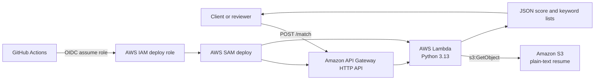

# AWS Resume Matcher

AWS Resume Matcher is a small serverless API that compares a job description against a plain-text resume stored in Amazon S3. It returns a keyword-overlap score, the matching keywords, and the missing keywords.

The project also includes an experimental Phase 1 semantic matching path for local validation. Semantic matching is guarded by `SEMANTIC_MATCHING_ENABLED=false` by default, so the production Lambda deployment remains keyword-based unless the feature is explicitly enabled in an environment where optional ML dependencies are available.

The project is designed as a practical AWS portfolio application: simple enough to review quickly, but complete enough to demonstrate Lambda, API Gateway, S3 access, AWS SAM infrastructure as code, GitHub Actions CI, and GitHub OIDC-based deployment.

## Architecture



## Technology Stack

- Python 3.13
- AWS Lambda
- Amazon API Gateway HTTP API
- Amazon S3
- AWS SAM
- GitHub Actions
- GitHub OIDC for AWS authentication
- Experimental local semantic matching with `sentence-transformers/all-MiniLM-L6-v2`

## AWS Services Used

- **AWS Lambda** runs the resume matching handler in `lambda/app.py`.
- **Amazon API Gateway HTTP API** exposes `POST /match`.
- **Amazon S3** stores the configured plain-text resume object.
- **AWS IAM** grants the Lambda function read access to the configured resume object and allows GitHub Actions to assume a deployment role.
- **AWS CloudFormation** is used through AWS SAM to provision and update the stack.

## Current Features

- Accepts a JSON request containing `job_description`.
- Reads a configured plain-text resume from S3.
- Extracts normalized keywords from the resume and job description.
- Filters common stop words.
- Returns:
  - `score`
  - `matching_keywords`
  - `missing_keywords`
- Rejects non-POST methods.
- Validates empty or malformed request bodies.
- Includes a pytest suite for keyword extraction, comparison scoring, request validation, error handling, and Lambda response structure.
- Defines infrastructure with AWS SAM.
- Runs automated tests, CI validation, and SAM build in GitHub Actions.
- Deploys from GitHub Actions to AWS using OIDC and repository variables.
- Includes guarded hybrid keyword + semantic scoring helpers for local validation. This path is not production-enabled by default.

## Local Development Setup

Install:

- Python 3.13
- AWS CLI
- AWS SAM CLI
- Git

Clone the repository and confirm the SAM template is valid:

```bash
git clone <repository-url>
cd aws-resume-matcher
python -m venv .venv
source .venv/bin/activate
python -m pip install -r requirements-dev.txt
python -m pytest
sam validate --template-file template.yaml
sam build --template-file template.yaml --cached --parallel
```

On Windows PowerShell, activate the virtual environment with:

```powershell
.\.venv\Scripts\Activate.ps1
```

This repository intentionally excludes resume files. For local experiments, create a private plain-text resume file outside version control, for example:

```text
sample-data/resume.txt
```

The `sample-data/` directory is ignored by Git to reduce the risk of publishing personal information.

### Experimental Semantic Matching

Phase 1 semantic matching is available for local validation only. It uses `sentence-transformers/all-MiniLM-L6-v2` when `SEMANTIC_MATCHING_ENABLED` is set to a truthy value such as `true`, `1`, `yes`, or `on`.

This repository does not add `sentence-transformers` to the default CI dependency set, does not download model weights in CI, and does not change SAM packaging. To experiment locally, install the optional dependency in your local environment:

```bash
python -m pip install sentence-transformers
```

Then enable semantic mode for a local run:

```text
SEMANTIC_MATCHING_ENABLED=true
SEMANTIC_MODEL_NAME=sentence-transformers/all-MiniLM-L6-v2
```

When semantic mode is disabled, responses keep the original production shape:

```json
{
  "score": 75,
  "matching_keywords": ["aws", "python", "s3"],
  "missing_keywords": ["docker"]
}
```

When semantic mode is enabled in a local environment with the optional dependency installed, responses include hybrid scoring details:

```json
{
  "score": 89,
  "keyword_score": 75,
  "semantic_score": 100,
  "matching_keywords": ["lambda", "python", "s3"],
  "missing_keywords": ["terraform"],
  "semantic_model": "sentence-transformers/all-MiniLM-L6-v2",
  "weights": {
    "keyword": 0.45,
    "semantic": 0.55
  }
}
```

## Running Locally

The Lambda function expects two environment variables:

```text
RESUME_BUCKET=<bucket containing the resume text file>
RESUME_KEY=<path/to/resume.txt>
```

For a local API run with SAM, use the template parameters that populate those variables:

```bash
sam build --template-file template.yaml --cached --parallel
sam local start-api \
  --parameter-overrides \
    ResumeBucket=<your-bucket> \
    ResumeKey=<your-resume-key>
```

Then call the local endpoint:

```bash
curl -X POST http://127.0.0.1:3000/match \
  -H "Content-Type: application/json" \
  -d "{\"job_description\":\"Python AWS Lambda S3 API Gateway\"}"
```

Expected response shape:

```json
{
  "score": 0,
  "matching_keywords": [],
  "missing_keywords": []
}
```

The exact values depend on the resume object and job description.

## AWS SAM Deployment Process

Infrastructure is defined in `template.yaml`. The SAM stack provisions:

- `ResumeMatcherApi`
- `ResumeMatcherFunction`
- Lambda environment variables for `RESUME_BUCKET` and `RESUME_KEY`
- An IAM policy allowing the function to read only the configured S3 object
- Stack outputs for the API endpoint and Lambda function ARN

Manual deployment can be performed with SAM:

```bash
sam validate --template-file template.yaml
sam build --template-file template.yaml --cached --parallel
sam deploy
```

The repository includes `samconfig.toml` with default build and deploy settings. The deploy parameter values should be reviewed before using them in another AWS account.

## GitHub Actions CI/CD Overview

The repository has two workflows:

- `.github/workflows/ci.yml`
  - Runs on pull requests and pushes to `main`.
  - Installs Python 3.13 and AWS SAM CLI.
  - Installs pytest test dependencies.
  - Runs `python -m pytest`.
  - Runs `sam validate`.
  - Runs `sam build --cached --parallel`.
  - Compiles Python sources under `lambda/`.
- `.github/workflows/deploy.yml`
  - Runs only on pushes to `main`.
  - Uses GitHub OIDC to assume an AWS deployment role.
  - Installs Python 3.13 and AWS SAM CLI.
  - Runs SAM validation, build, and deployment.

The deployment workflow uses these GitHub repository variables:

- `AWS_REGION`
- `AWS_DEPLOY_ROLE_ARN`
- `SAM_STACK_NAME`
- `RESUME_BUCKET`
- `RESUME_KEY`

## GitHub OIDC Authentication Overview

The deploy workflow uses `aws-actions/configure-aws-credentials` with GitHub OIDC. Instead of storing long-lived AWS access keys in GitHub, GitHub requests a short-lived OIDC token during the workflow run. AWS IAM validates that token against the trust policy on the configured deployment role, then issues temporary credentials for the job.

At a high level, the AWS deployment role should:

- Trust GitHub's OIDC identity provider.
- Restrict assumptions to the intended repository, branch, and workflow context.
- Grant only the permissions required for SAM and CloudFormation deployment.

No AWS secrets are stored in the repository.

## Repository Structure

```text
.
|-- .github/
|   `-- workflows/
|       |-- ci.yml
|       `-- deploy.yml
|-- frontend/
|   `-- index.html
|-- lambda/
|   `-- app.py
|-- tests/
|   |-- conftest.py
|   `-- test_app.py
|-- sample-data/
|   `-- resume.txt
|-- .gitignore
|-- CONTEXT.md
|-- README.md
|-- requirements-dev.txt
|-- samconfig.toml
`-- template.yaml
```

Notes:

- `frontend/index.html` is currently present but empty.
- `sample-data/` is ignored by Git and should not be used for public resume data.
- `.aws-sam/`, caches, virtual environments, and Python bytecode are ignored.

## Future Roadmap

- Add a small frontend for reviewer-friendly API interaction.
- Support PDF or DOCX resume ingestion.
- Evaluate production deployment options for guarded semantic matching, including Lambda container images, Amazon Bedrock embeddings, precomputed resume embeddings, and local-only semantic mode.
- Add weighted scoring for skills, certifications, seniority, and domain experience.
- Support multiple resumes and candidate ranking.
- Add authentication or rate limiting before any public deployment.
- Add structured logging, tracing, and operational metrics.
- Add a separate deployment environment strategy, such as dev and prod stacks.

## Version History Summary

- **v1.0.0 / `v1.0-serverless-api`**: Introduced the serverless resume matching API and removed local resume data from tracked files.
- **v1.0.1**: Improved deployment documentation for the initial Lambda-based MVP.
- **v1.1.0**: Migrated infrastructure into AWS SAM with an HTTP API, Lambda function, IAM policy, and stack outputs.
- **v1.2.0**: Added GitHub Actions CI/CD support, including SAM validation/build in CI and OIDC-based deployment from pushes to `main`.
- **v1.3.0**: Added pytest-based automated testing and updated CI to run tests before SAM validation and build.
- **v2.0.0-alpha.1**: Added guarded local semantic scoring helpers with mocked tests while preserving keyword-only production Lambda behavior by default.
